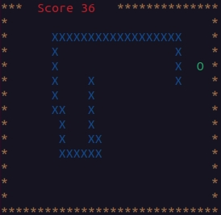

# Snake

My first mobile phone was Nokia 3210


What a great phone. One of its many terrific features was the game Snake.

Now 25 years later I have written the game in C using the Curses library.

My kids have enjoyed testing this for me.



## Getting Started

The game comes with a makefile. Simply type make when in the directory and it will compile.

## Prerequisites

You will need to have the Curses library. The below command will install it if you don't already have it.

```
sudo apt-get install libncurses5-dev libncursesw5-dev
```

## Author

* **hatchet-elf**
* **https://github.com/hatchet-elf/spaceinvaders**


## License

This project is licensed under the MIT License - see the [LICENSE] file for details


